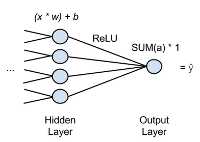
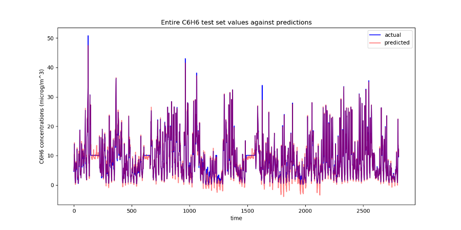

# keras-benzene-levels

This is an example of using linear regression using data from the
[UCI Air Quality Data Set](https://archive.ics.uci.edu/ml/datasets/Air+Quality),
by implementing a Regression Network with Keras. A tutorial on Regression
Networks can be found at the [DL4J site](https://deeplearning4j.org/logistic-regression).

## Quick Start

Run benzene-prediction.py. The air quality data set is already included in the aqm_data 
directory. The scripts runs under Python 3.5 using Keras 2.x, scikit-learn, numpy, and pandas. 
A TensorFlow 1.5 back end was used.

## The Air Quality Data

The UCI dataset contains 9358 instances of hourly averaged responses from
an array of 5 metal oxide chemical sensors embedded in an Air Quality
Chemical Multisensor Device. The device was located on the field in a
significantly polluted area, at road level,within an Italian city.
Data were recorded from March 2004 to February 2005 (one year) representing
the longest freely available recordings of on field deployed air quality
chemical sensor devices responses. Ground Truth hourly averaged concentrations
for CO, Non Metanic Hydrocarbons, Benzene, Total Nitrogen Oxides (NOx) and
Nitrogen Dioxide (NO2) and were provided by a co-located reference certified
analyzer.

The dataset columns are:

* Date (DD/MM/YYYY)
* Time (HH.MM.SS)
* True hourly averaged concentration CO in mg/m^3 (reference analyzer)
* PT08.S1 (tin oxide) hourly averaged sensor response (nominally CO targeted)
* True hourly averaged overall Non Metanic HydroCarbons concentration in microg/m^3 (reference analyzer)
* True hourly averaged Benzene concentration in microg/m^3 (reference analyzer)
* PT08.S2 (titania) hourly averaged sensor response (nominally NMHC targeted)
* True hourly averaged NOx concentration in ppb (reference analyzer)
* PT08.S3 (tungsten oxide) hourly averaged sensor response (nominally NOx targeted)
* True hourly averaged NO2 concentration in microg/m^3 (reference analyzer)
* PT08.S4 (tungsten oxide) hourly averaged sensor response (nominally NO2 targeted)
* PT08.S5 (indium oxide) hourly averaged sensor response (nominally O3 targeted)
* Temperature in °C
* Relative Humidity (%)
* AH Absolute Humidity

## Cleaning Up The Data

This is the **important** step! Without an adequate clean up crazy results can ensue, as illustrated 
in Chapter 7 of *Deep Learning with Keras* by Gulli & Pal (Packt Publishing), 
where, along with a few coding errors, Benzine concentrations of below -100 micrograms 
per meter cubed are predicted - a sure sign something has gone wrong!

To do this we use Pandas to load the CSV data, which is in European semi-colon separated, with commas for 
decimal points, format. The first thing to note is that missing values are tagged with a -200 value. 

First looking at the columns, we don't need the last two NaN/empty columns, and the 
time and date columns. The Non Metanic HydroCarbons column, NMHC(GT), is mainly -200 missing values, so has 
barely anything useful in it, so that can go too.

Another inspection of the data show that there a lot of NaN/empty rows at the end of the data, so get rid of 
these.

Finally, to deal with the few -200 (missing value) entries dotted around we fill them in with their respective 
mean of value of the column they are in.

So from the initial 17 columns this leaves us with 12 columns of features. From this we remove the Benzene 
column as the target, leaving 11 features as the input to the Regression Network.

## Normalization

Due to the scales of measurement and data ranges for the columns, each column of data is scaled using the 
handy [scikit-learn StandardScaler](http://scikit-learn.org/stable/modules/generated/sklearn.preprocessing.StandardScaler.html) 
which subtracts from each column the mean of the column and divides by its standard deviation.

## The Regression Network

The regression network used here is a simple two layer dense network that takes 
a vector of 11 features from the dataset as input and outputs a scaled prediction, The 
hidden dense layer (latent space) has eight neurons.

The network's weight matrices for the all layers are initialized using *glorot uniform*. 
The efficient ADAM optimization algorithm is used and a mean squared error loss function 
is optimized.

## The Results

The example achieves a training loss (mean squared error) of 0.0013, and a 
validation loss (mean squared error) of 0.0071.

**However, don't forget you can achieve good losses / predictions for garbage input data - so 
always check the data clean-up stage, as well as the usual bias/variance and underfitting/overfitting!**

